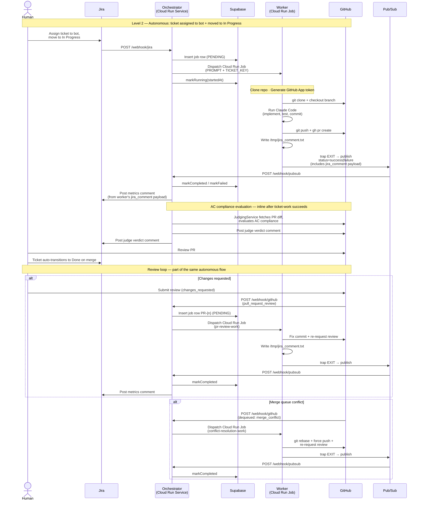

# Agent Pipeline — Autonomous Flow

The full Level 2 autonomous loop from Jira ticket to merged PR, including the PR review and
conflict resolution cycles. Both review response and conflict resolution are webhook handlers
in the same orchestrator — not separate levels.

## Key design decisions

**Producer-owned events.** The worker signals its own completion via Pub/Sub (`trap EXIT`).
The orchestrator never polls Cloud Logging to determine if work is done — logs are for
observability, not control flow.

**Dedup gate.** Before every dispatch, the orchestrator checks Supabase:
- `RUNNING` or `COMPLETED` → skip (duplicate webhook or already finished)
- `FAILED` or `INTERRUPTED` → re-dispatch (retry eligible)

**Synthetic dedup keys.** PR review and conflict resolution jobs use keys like `PR-{n}` and
`CONFLICT-{n}` to deduplicate by PR, not by ticket. `JIRA_TICKET_KEY` is passed separately
so the orchestrator can post the Jira comment to the correct issue.

**Worker-owned Jira comments.** The worker writes `/tmp/jira_comment.txt` and includes the
content in the Pub/Sub completion payload. The orchestrator forwards it to Jira as the Media
Sage Bot identity. This keeps Jira communication coupled to the work that generated it.

**Wall-clock duration.** The Jira metrics comment shows `startedAt` (Supabase, set on dispatch)
to Pub/Sub receipt time — not Claude Code API time from Cloud Logging.
