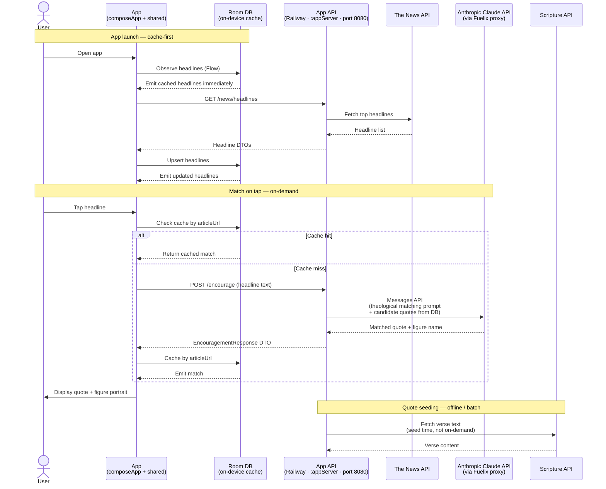

# App Flow — End-to-End

How The Media Sage app works from launch to displayed match, including all external API roles.

## API roles

| API | When called | Purpose |
|-----|-------------|---------|
| The News API | On app launch + periodic refresh | Source live headlines |
| Anthropic Claude API | On headline tap (cache miss) | Match headline to theological quote |
| Scripture API | Batch seed time | Populate authoritative verse text for figures |

## Caching strategy

Matches are cached in Room by `articleUrl` (not headline ID — auto-increment IDs are unstable
across refreshes). A cache hit skips the Claude API call entirely, keeping cost and latency low
for repeated taps on the same headline.

## Claude prompt shape

The server sends Claude a theological matching prompt with:
- The headline text
- A set of candidate quotes from the DB (filtered by theme relevance)

Claude returns a single quote + figure name. The server wraps it into an `EncouragementResponse`
and the client caches it by `articleUrl`.
