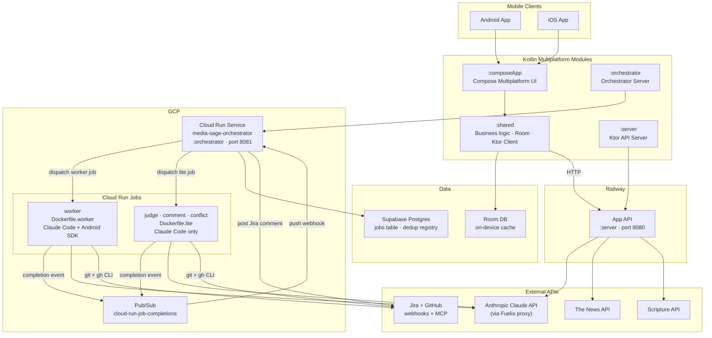

# Infrastructure Overview



## Module responsibilities

| Module | Runtime | Deployed to |
|--------|---------|-------------|
| `:composeApp` | Android + iOS | App stores |
| `:shared` | Android + iOS | Bundled with app |
| `:server` | JVM (Netty, port 8080) | Railway |
| `:orchestrator` | JVM (Netty, port 8081) | GCP Cloud Run Service |

## Data flow (product)

Room is the single source of truth for the app. The UI always reads from Room via Flow.
Network calls update Room.

```
Server JSON → Client DTO → Room Entity → Domain Model → UI
```

## Agent infrastructure

The orchestrator is a long-running Cloud Run **Service** (always on, min 1 instance).
Workers are Cloud Run **Jobs** — spun up on demand per ticket, run to completion, then torn down.
Supabase persists the job registry across orchestrator restarts.
